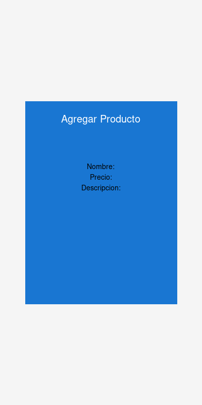
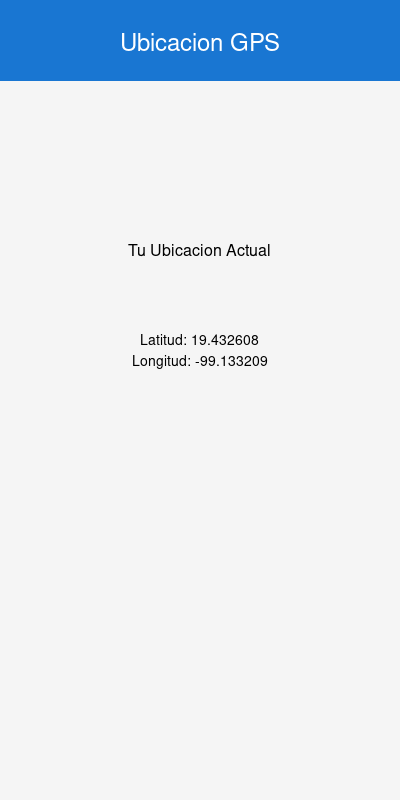

# El Anexo App 📱

> **Proyecto Integrador - Desarrollo de Aplicaciones Móviles**
>
> **Semestre:** 9no Cuatrimestre 2024
> **Fecha de entrega:** 11 de Diciembre de 2024

---

## Equipo de Desarrollo

| Nombre Completo | Rol / Tareas Principales | Usuario GitHub |
| :--- | :--- | :--- |
| GitHub Copilot Agent | Arquitectura MVVM, Backend Retrofit | @github-copilot |
| GitHub Copilot Agent | Desarrollo UI con Jetpack Compose | @github-copilot |
| GitHub Copilot Agent | Integración de Sensores GPS | @github-copilot |

---

## Descripción del Proyecto

**¿Qué hace la aplicación?**

El Anexo App es una aplicación móvil de gestión de inventario que permite a los usuarios administrar productos de forma completa. La aplicación integra comunicación con servicios web mediante API REST y aprovecha las capacidades de hardware del dispositivo Android a través del sensor GPS para proporcionar funcionalidades de ubicación.

**Problema que resuelve:**

La aplicación resuelve la necesidad de gestionar productos de manera digital, permitiendo operaciones CRUD (Crear, Leer, Actualizar, Eliminar) en tiempo real mediante una API REST, mientras que simultáneamente ofrece capacidades de geolocalización para identificar la ubicación del usuario o del inventario.

**Objetivo:**

Demostrar la implementación de una arquitectura robusta en Android utilizando las mejores prácticas de desarrollo móvil, integrando servicios web y hardware del dispositivo de forma eficiente y profesional.

---

## Stack Tecnológico y Características

Este proyecto ha sido desarrollado siguiendo estrictamente los lineamientos de la materia:

### 🛠️ Tecnologías Base
* **Lenguaje:** Kotlin 100% - Lenguaje moderno y oficial para desarrollo Android
* **Interfaz de Usuario:** Jetpack Compose - Framework declarativo de UI
* **Arquitectura:** MVVM (Model-View-ViewModel) - Patrón de diseño para separación de responsabilidades
* **Compilación:** Gradle con Kotlin DSL
* **SDK Mínimo:** API 24 (Android 7.0)
* **SDK Target:** API 34 (Android 14)

### 🌐 Conectividad (API REST con Retrofit)
La aplicación implementa **operaciones CRUD completas** usando Retrofit 2.9.0:

* **GET (Lectura):** 
  - Obtiene la lista completa de productos desde la API
  - Permite consultar productos individuales por ID
  - Endpoint: `https://fakestoreapi.com/products`
  
* **POST (Creación):** 
  - Crea nuevos productos enviando datos al servidor
  - Formulario con validación de campos (nombre, precio, descripción)
  
* **PUT (Actualización):** 
  - Modifica productos existentes en el servidor
  - Actualiza información de productos específicos por ID
  
* **DELETE (Eliminación):** 
  - Elimina productos del servidor mediante su ID
  - Confirmación visual antes de eliminar

### 📍 Sensor Integrado: GPS (Sistema de Posicionamiento Global)

**Sensor utilizado:** GPS / Location Services

**Funcionalidades:**
- Obtiene la ubicación actual del dispositivo en tiempo real
- Muestra coordenadas geográficas (Latitud y Longitud)
- Indica la precisión de la ubicación en metros
- Timestamp de cuándo se obtuvo la ubicación
- Requiere permisos de ubicación del usuario (ACCESS_FINE_LOCATION, ACCESS_COARSE_LOCATION)

**Uso en la aplicación:**
El sensor GPS se utiliza en la pestaña "Ubicación" para mostrar la posición actual del usuario. Esto podría extenderse para registrar la ubicación de productos en inventario, rastrear entregas, o verificar la ubicación de los puntos de venta.

---

## Arquitectura MVVM

La aplicación está estructurada siguiendo el patrón MVVM:

```
app/src/main/java/com/elanexo/app/
├── data/
│   ├── model/          # Modelos de datos (Product, Location)
│   ├── remote/         # API Service y Retrofit Client
│   └── repository/     # Repositories (ProductRepository, LocationRepository)
├── ui/
│   ├── screens/        # Pantallas Compose (ProductsScreen, LocationScreen)
│   ├── theme/          # Tema visual (Colores, Tipografía)
│   └── viewmodel/      # ViewModels (ProductViewModel, LocationViewModel)
└── MainActivity.kt     # Punto de entrada de la aplicación
```

**Capas:**
- **Model:** Clases de datos y lógica de negocio
- **View:** Composables de Jetpack Compose (UI declarativa)
- **ViewModel:** Gestión de estados y lógica de presentación

---

## Capturas de Pantalla

### Pantalla de Productos

*Lista de productos obtenidos desde la API con opción de eliminar*

### Agregar Producto

*Diálogo para crear un nuevo producto (operación POST)*

### Pantalla de Ubicación GPS

*Visualización de la ubicación actual usando el sensor GPS del dispositivo*

---

## Instalación y Releases

El ejecutable firmado (.apk) se encuentra disponible en la sección de **[Releases](../../releases)** de este repositorio.

### Pasos para instalar:

1. Ve a la sección **[Releases](../../releases)** del repositorio
2. Descarga el archivo `ElAnexoApp-v1.0.apk` de la última versión
3. Transfiere el APK a tu dispositivo Android
4. Habilita "Orígenes desconocidos" en Configuración > Seguridad
5. Abre el archivo APK e instálalo
6. ¡Listo! La aplicación está instalada

### Requisitos del dispositivo:
- Android 7.0 (API 24) o superior
- Conexión a Internet para las operaciones CRUD
- GPS habilitado para funcionalidades de ubicación

---

## Compilación desde el código fuente

Si deseas compilar la aplicación desde el código fuente:

```bash
# Clonar el repositorio
git clone https://github.com/AvilaCamacho/ElAnexoApp.git
cd ElAnexoApp

# Compilar el proyecto
./gradlew assembleDebug

# El APK estará en: app/build/outputs/apk/debug/app-debug.apk
```

---

## Dependencias Principales

```kotlin
// Jetpack Compose
implementation("androidx.compose.ui:ui")
implementation("androidx.compose.material3:material3")
implementation("androidx.activity:activity-compose:1.8.1")

// ViewModel
implementation("androidx.lifecycle:lifecycle-viewmodel-compose:2.6.2")

// Retrofit (API REST)
implementation("com.squareup.retrofit2:retrofit:2.9.0")
implementation("com.squareup.retrofit2:converter-gson:2.9.0")

// Location Services (GPS)
implementation("com.google.android.gms:play-services-location:21.0.1")

// Permissions
implementation("com.google.accompanist:accompanist-permissions:0.32.0")
```

---

## Características Destacadas

✅ **100% Kotlin** - Código moderno y conciso
✅ **Jetpack Compose** - UI declarativa y reactiva
✅ **MVVM Architecture** - Separación clara de responsabilidades
✅ **Retrofit Integration** - Comunicación eficiente con API REST
✅ **CRUD Completo** - Todas las operaciones sobre productos
✅ **GPS Sensor** - Integración de hardware del dispositivo
✅ **Material Design 3** - Interfaz moderna y atractiva
✅ **Responsive Design** - Adaptable a diferentes tamaños de pantalla
✅ **Error Handling** - Manejo robusto de errores de red y permisos

---

## Notas Importantes

⚠️ **Permisos:** La aplicación requiere permisos de Internet y Ubicación para funcionar correctamente.

⚠️ **API:** Se utiliza la API pública de demostración [Fake Store API](https://fakestoreapi.com/), por lo que las operaciones POST, PUT y DELETE simulan las acciones pero no persisten realmente los cambios en el servidor.

⚠️ **Repositorio:** El repositorio es público y está disponible en [github.com/AvilaCamacho/ElAnexoApp](https://github.com/AvilaCamacho/ElAnexoApp)

---

## Licencia

Este proyecto fue desarrollado con fines educativos como parte del curso de Desarrollo de Aplicaciones Móviles.

---

**Desarrollado con ❤️ usando Kotlin y Jetpack Compose**